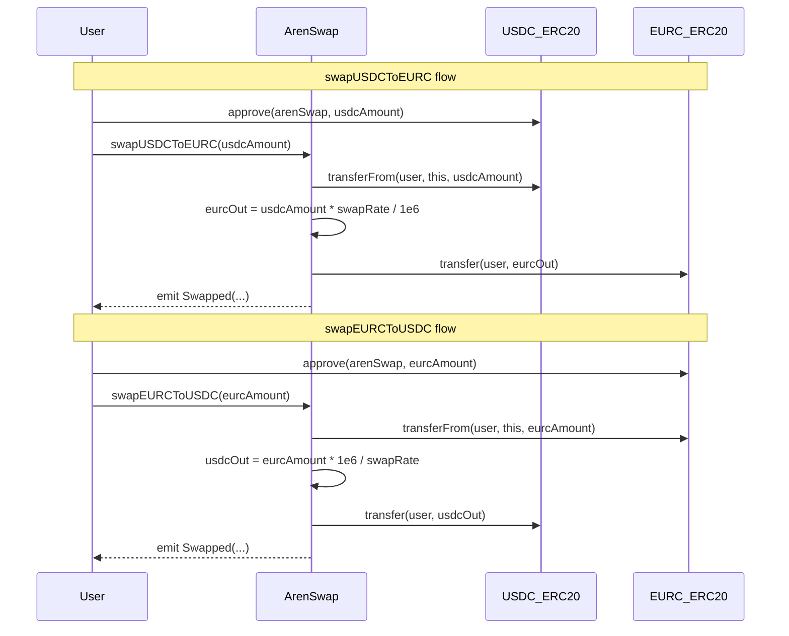
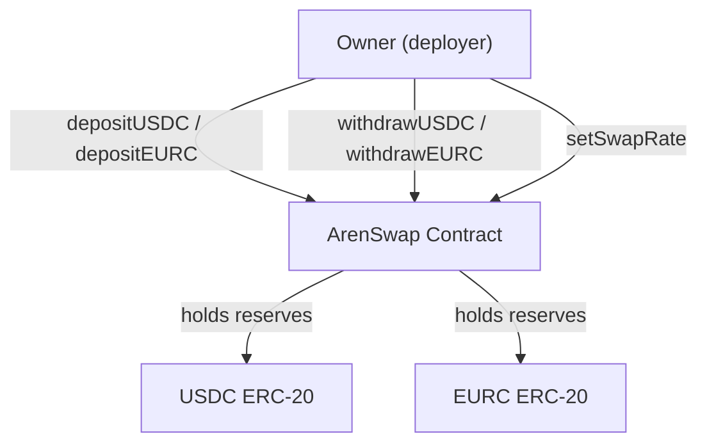

# Design Document: ArenSwap Contracts

## Overview

This document describes the technical design for the ArenSwap smart contract core logic — a reserve-based AMM for bidirectional USDC↔EURC swaps on the Arc Testnet. The deliverables are three files inside the existing Foundry project at `arenswap-contracts/`:

- **`src/ArenSwap.sol`** — production contract replacing the scaffold stubs with full swap logic, liquidity management, and access control.
- **`test/ArenSwap.t.sol`** — comprehensive Foundry unit and fuzz tests.
- **`script/ArenSwap.s.sol`** — deployment script targeting Arc Testnet with hardcoded token addresses and initial swap rate.

The contract is intentionally minimal: no upgradability, no fee mechanism, no oracle — just a fixed-rate reserve pool with owner-managed liquidity. This keeps the attack surface small and the arithmetic auditable.

**Arc Testnet token addresses:**

| Token | Address | Decimals |
|---|---|---|
| USDC | `0x3600000000000000000000000000000000000000` | 6 |
| EURC | `0x89B50855Aa3bE2F677cD6303Cec089B5F319D72a` | 6 |

> **Critical**: USDC on Arc has a dual interface — a native 18-decimal gas token and an ERC-20 6-decimal token. The contract MUST always use the ERC-20 interface at the address above. Never use the native interface.

---

## Architecture

### Repository Layout

```
arenswap-contracts/
├── src/
│   └── ArenSwap.sol          # Production contract (replaces scaffold stubs)
├── test/
│   ├── ArenSwap.t.sol        # Unit + fuzz tests
│   └── mocks/
│       └── MockERC20.sol     # Minimal ERC-20 mock for tests
├── script/
│   └── ArenSwap.s.sol        # Arc Testnet deployment script
├── lib/
│   └── forge-std/            # Foundry standard library
└── foundry.toml
```

### Contract Interaction Flow



### Ownership and Liquidity Flow



---

## Components and Interfaces

### `src/ArenSwap.sol` — Full Contract

#### State Variables

| Variable | Type | Mutability | Description |
|---|---|---|---|
| `usdc` | `address` | `immutable` | USDC ERC-20 contract address, set in constructor |
| `eurc` | `address` | `immutable` | EURC ERC-20 contract address, set in constructor |
| `swapRate` | `uint256` | mutable (owner only) | EURC units per USDC unit, scaled by `1e6`. `921500` = 0.9215 EURC/USDC |
| `owner` | `address` | mutable (owner only) | Contract administrator |

#### Events

```solidity
event Swapped(
    address indexed caller,
    address indexed tokenIn,
    address indexed tokenOut,
    uint256 amountIn,
    uint256 amountOut
);

event LiquidityDeposited(
    address indexed token,
    uint256 amount
);
```

#### Modifiers

```solidity
modifier onlyOwner() {
    require(msg.sender == owner, "ArenSwap: caller is not the owner");
    _;
}
```

#### Function Signatures

```solidity
// Swap functions
function swapUSDCToEURC(uint256 usdcAmount) external;
function swapEURCToUSDC(uint256 eurcAmount) external;

// Liquidity management (owner only)
function depositUSDC(uint256 amount) external onlyOwner;
function depositEURC(uint256 amount) external onlyOwner;
function withdrawUSDC(uint256 amount) external onlyOwner;
function withdrawEURC(uint256 amount) external onlyOwner;

// Rate management (owner only)
function setSwapRate(uint256 newRate) external onlyOwner;
```

#### Inline IERC20 Interface

The contract retains the inline interface from the scaffold — no external dependencies:

```solidity
interface IERC20 {
    function transfer(address to, uint256 amount) external returns (bool);
    function transferFrom(address from, address to, uint256 amount) external returns (bool);
    function approve(address spender, uint256 amount) external returns (bool);
    function balanceOf(address account) external view returns (uint256);
}
```

---

### `test/mocks/MockERC20.sol` — Test Mock

A minimal ERC-20 implementation for tests. No SafeMath, no hooks, no permit — just the four functions needed by ArenSwap plus a `mint` function for test setup.

```solidity
// SPDX-License-Identifier: MIT
pragma solidity ^0.8.20;

contract MockERC20 {
    string public name;
    string public symbol;
    uint8 public decimals;

    mapping(address => uint256) public balanceOf;
    mapping(address => mapping(address => uint256)) public allowance;

    constructor(string memory _name, string memory _symbol, uint8 _decimals) {
        name = _name;
        symbol = _symbol;
        decimals = _decimals;
    }

    function mint(address to, uint256 amount) external {
        balanceOf[to] += amount;
    }

    function approve(address spender, uint256 amount) external returns (bool) {
        allowance[msg.sender][spender] = amount;
        return true;
    }

    function transfer(address to, uint256 amount) external returns (bool) {
        require(balanceOf[msg.sender] >= amount, "MockERC20: insufficient balance");
        balanceOf[msg.sender] -= amount;
        balanceOf[to] += amount;
        return true;
    }

    function transferFrom(address from, address to, uint256 amount) external returns (bool) {
        require(balanceOf[from] >= amount, "MockERC20: insufficient balance");
        require(allowance[from][msg.sender] >= amount, "MockERC20: insufficient allowance");
        allowance[from][msg.sender] -= amount;
        balanceOf[from] -= amount;
        balanceOf[to] += amount;
        return true;
    }
}
```

**Design decision — no `totalSupply` or `Transfer`/`Approval` events**: ArenSwap only calls `transfer`, `transferFrom`, and `balanceOf`. The mock implements exactly what is needed and nothing more, keeping it auditable and fast to compile.

---

### `script/ArenSwap.s.sol` — Deployment Script

```solidity
// SPDX-License-Identifier: MIT
pragma solidity ^0.8.20;

import "forge-std/Script.sol";
import "../src/ArenSwap.sol";

contract ArenSwapScript is Script {
    address constant USDC = 0x3600000000000000000000000000000000000000;
    address constant EURC = 0x89B50855Aa3bE2F677cD6303Cec089B5F319D72a;
    uint256 constant INITIAL_SWAP_RATE = 921500; // 0.9215 EURC per USDC

    function run() external {
        vm.startBroadcast();
        ArenSwap arenSwap = new ArenSwap(USDC, EURC);
        arenSwap.setSwapRate(INITIAL_SWAP_RATE);
        vm.stopBroadcast();
    }
}
```

**Design decision — `setSwapRate` called inside broadcast**: The rate is set in the same broadcast session as deployment so the contract is never in a deployed-but-unrated state on-chain. Any swap attempted between deployment and a separate rate-setting tx would revert with `"ArenSwap: swap rate not set"`, but calling it in the same session eliminates that window entirely.

---

## Data Models

### Swap Rate Encoding

`swapRate` is a `uint256` representing the number of EURC micro-units returned per USDC micro-unit, scaled by `1e6`.

| swapRate value | Effective rate | Meaning |
|---|---|---|
| `1000000` | 1.000000 | 1 USDC = 1.000000 EURC |
| `921500` | 0.921500 | 1 USDC = 0.9215 EURC |
| `1085000` | 1.085000 | 1 USDC = 1.085 EURC |

Both USDC and EURC use 6 decimals, so `1 USDC = 1_000_000` in raw token units. The `1e6` scaling factor in `swapRate` is chosen to match this decimal precision, allowing sub-unit rate granularity (e.g., `921500` gives 4 significant figures of rate precision).

### ArenSwap Contract State

```
ArenSwap {
    usdc:      address   // immutable, set at construction
    eurc:      address   // immutable, set at construction
    swapRate:  uint256   // mutable, owner-only, scaled by 1e6
    owner:     address   // mutable, set at construction to msg.sender
}
```

### Event Data

```
Swapped {
    caller:    address   // indexed — msg.sender of the swap call
    tokenIn:   address   // indexed — token sent by caller
    tokenOut:  address   // indexed — token received by caller
    amountIn:  uint256   // raw token units sent
    amountOut: uint256   // raw token units received
}

LiquidityDeposited {
    token:     address   // indexed — USDC or EURC address
    amount:    uint256   // raw token units deposited
}
```

---

## Function-by-Function Design

### `swapUSDCToEURC(uint256 usdcAmount)`

**Purpose**: User sends USDC, receives EURC at the current swap rate.

**Execution steps:**
1. `require(usdcAmount > 0, "ArenSwap: amount must be greater than zero")`
2. `require(swapRate > 0, "ArenSwap: swap rate not set")`
3. Compute: `uint256 eurcOut = usdcAmount * swapRate / 1e6`
4. `require(IERC20(eurc).balanceOf(address(this)) >= eurcOut, "ArenSwap: insufficient EURC reserve")`
5. `IERC20(usdc).transferFrom(msg.sender, address(this), usdcAmount)` — reverts if caller has insufficient allowance or balance
6. `IERC20(eurc).transfer(msg.sender, eurcOut)`
7. `emit Swapped(msg.sender, usdc, eurc, usdcAmount, eurcOut)`

**Overflow safety**: With `usdcAmount <= type(uint128).max` and `swapRate <= type(uint128).max`, the product `usdcAmount * swapRate <= type(uint128).max * type(uint128).max = 2^256 - 2^129 + 1`, which fits in `uint256`. No `unchecked` block is used; Solidity 0.8.x checked arithmetic provides the safety net for inputs outside this range.

**Design decision — reserve check before transferFrom**: The reserve check happens before pulling USDC from the caller. This avoids a scenario where the caller's USDC is pulled but the EURC transfer fails, leaving the caller worse off. Fail fast with no state changes.

---

### `swapEURCToUSDC(uint256 eurcAmount)`

**Purpose**: User sends EURC, receives USDC at the current swap rate.

**Execution steps:**
1. `require(eurcAmount > 0, "ArenSwap: amount must be greater than zero")`
2. `require(swapRate > 0, "ArenSwap: swap rate not set")`
3. Compute: `uint256 usdcOut = eurcAmount * 1e6 / swapRate`
4. `require(IERC20(usdc).balanceOf(address(this)) >= usdcOut, "ArenSwap: insufficient USDC reserve")`
5. `IERC20(eurc).transferFrom(msg.sender, address(this), eurcAmount)` — reverts if caller has insufficient allowance or balance
6. `IERC20(usdc).transfer(msg.sender, usdcOut)`
7. `emit Swapped(msg.sender, eurc, usdc, eurcAmount, usdcOut)`

**Note on integer truncation**: `eurcAmount * 1e6 / swapRate` truncates toward zero. For example, with `swapRate = 921500` and `eurcAmount = 1`, `usdcOut = 1_000_000 / 921_500 = 1` (truncated from 1.085...). This is expected Solidity integer division behavior and is documented in the requirements.

---

### `depositUSDC(uint256 amount)` / `depositEURC(uint256 amount)`

**Purpose**: Owner adds liquidity to the contract reserves.

**Execution steps (USDC variant; EURC is symmetric):**
1. `onlyOwner` modifier check
2. `require(amount > 0, "ArenSwap: amount must be greater than zero")`
3. `IERC20(usdc).transferFrom(msg.sender, address(this), amount)` — owner must have pre-approved the contract
4. `emit LiquidityDeposited(usdc, amount)`

**Design decision — no internal reserve tracking**: The contract reads live ERC-20 balances via `balanceOf` rather than maintaining a separate `uint256 usdcReserve` state variable. This eliminates a class of accounting bugs where the tracked reserve diverges from the actual balance (e.g., if tokens are sent directly to the contract address). The tradeoff is one extra `SLOAD` per swap for the `balanceOf` call, which is acceptable.

---

### `withdrawUSDC(uint256 amount)` / `withdrawEURC(uint256 amount)`

**Purpose**: Owner removes liquidity from the contract reserves.

**Execution steps (USDC variant; EURC is symmetric):**
1. `onlyOwner` modifier check
2. `IERC20(usdc).transfer(msg.sender, amount)` — reverts if `amount > balanceOf(address(this))`

**Design decision — no explicit reserve check**: The ERC-20 `transfer` call will revert if the contract balance is insufficient. Adding a redundant `require` before it would be defensive but adds gas cost and code. The revert message from the ERC-20 is sufficient for the owner to diagnose the issue.

---

### `setSwapRate(uint256 newRate)`

**Purpose**: Owner updates the exchange rate.

**Execution steps:**
1. `onlyOwner` modifier check
2. `require(newRate > 0, "ArenSwap: rate must be greater than zero")`
3. `swapRate = newRate`

**Design decision — no `RateUpdated` event**: The requirements do not specify an event for rate changes. One could be added in a future iteration for off-chain indexing, but it is out of scope here.

---

## Correctness Properties

*A property is a characteristic or behavior that should hold true across all valid executions of a system — essentially, a formal statement about what the system should do. Properties serve as the bridge between human-readable specifications and machine-verifiable correctness guarantees.*

The prework analysis identified three consolidated properties after eliminating redundancy across Requirements 1, 2, 3, 5, 6, and 8. Properties 1 and 2 (arithmetic formulas) each appeared in three separate requirements and are unified. Properties 3.3, 3.4, 5.3, 5.4, and 6.2 all describe the same `onlyOwner` invariant and are unified into Property 3.

### Property 1: USDC→EURC output formula

*For any* `usdcAmount` in `[1, type(uint128).max]` and any `swapRate` in `[1, type(uint128).max]`, calling `swapUSDCToEURC(usdcAmount)` on a contract with sufficient EURC reserve SHALL transfer exactly `usdcAmount * swapRate / 1e6` EURC to the caller (Solidity integer division).

**Validates: Requirements 1.1, 2.1, 2.5, 8.1**

---

### Property 2: EURC→USDC output formula

*For any* `eurcAmount` in `[1, type(uint128).max]` and any `swapRate` in `[1, type(uint128).max]`, calling `swapEURCToUSDC(eurcAmount)` on a contract with sufficient USDC reserve SHALL transfer exactly `eurcAmount * 1e6 / swapRate` USDC to the caller (Solidity integer division).

**Validates: Requirements 1.2, 2.2, 8.2**

---

### Property 3: Non-owner calls to owner-protected functions always revert

*For any* address `caller` where `caller != owner`, calling any of `setSwapRate`, `depositUSDC`, `depositEURC`, `withdrawUSDC`, or `withdrawEURC` SHALL revert with the message `"ArenSwap: caller is not the owner"`.

**Validates: Requirements 3.3, 3.4, 5.3, 5.4, 6.2**

---

## Error Handling

### Revert Conditions

| Function | Condition | Revert message |
|---|---|---|
| `swapUSDCToEURC` | `usdcAmount == 0` | `"ArenSwap: amount must be greater than zero"` |
| `swapUSDCToEURC` | `swapRate == 0` | `"ArenSwap: swap rate not set"` |
| `swapUSDCToEURC` | computed `eurcOut > EURC balance` | `"ArenSwap: insufficient EURC reserve"` |
| `swapUSDCToEURC` | caller has insufficient USDC allowance | ERC-20 revert (no custom message) |
| `swapEURCToUSDC` | `eurcAmount == 0` | `"ArenSwap: amount must be greater than zero"` |
| `swapEURCToUSDC` | `swapRate == 0` | `"ArenSwap: swap rate not set"` |
| `swapEURCToUSDC` | computed `usdcOut > USDC balance` | `"ArenSwap: insufficient USDC reserve"` |
| `swapEURCToUSDC` | caller has insufficient EURC allowance | ERC-20 revert (no custom message) |
| `depositUSDC` | non-owner caller | `"ArenSwap: caller is not the owner"` |
| `depositUSDC` | `amount == 0` | `"ArenSwap: amount must be greater than zero"` |
| `depositEURC` | non-owner caller | `"ArenSwap: caller is not the owner"` |
| `depositEURC` | `amount == 0` | `"ArenSwap: amount must be greater than zero"` |
| `withdrawUSDC` | non-owner caller | `"ArenSwap: caller is not the owner"` |
| `withdrawUSDC` | `amount > USDC balance` | ERC-20 revert |
| `withdrawEURC` | non-owner caller | `"ArenSwap: caller is not the owner"` |
| `withdrawEURC` | `amount > EURC balance` | ERC-20 revert |
| `setSwapRate` | non-owner caller | `"ArenSwap: caller is not the owner"` |
| `setSwapRate` | `newRate == 0` | `"ArenSwap: rate must be greater than zero"` |

### Arithmetic Safety

Solidity `^0.8.20` uses checked arithmetic by default. Overflow in `usdcAmount * swapRate` will revert automatically for inputs exceeding `uint128.max` on either operand. No `unchecked` blocks are used in swap arithmetic.

---

## Testing Strategy

### Test File Structure (`test/ArenSwap.t.sol`)

```solidity
contract ArenSwapTest is Test {
    ArenSwap public arenSwap;
    MockERC20 public mockUsdc;
    MockERC20 public mockEurc;

    address public owner;
    address public user;

    uint256 constant SWAP_RATE    = 921_500;   // 0.9215 EURC per USDC
    uint256 constant RESERVE_SIZE = 1_000_000e6; // 1M tokens (6 decimals)

    function setUp() public {
        owner = address(this);
        user  = makeAddr("user");

        mockUsdc  = new MockERC20("USD Coin", "USDC", 6);
        mockEurc  = new MockERC20("Euro Coin", "EURC", 6);
        arenSwap  = new ArenSwap(address(mockUsdc), address(mockEurc));

        // Seed reserves
        mockUsdc.mint(address(arenSwap), RESERVE_SIZE);
        mockEurc.mint(address(arenSwap), RESERVE_SIZE);

        // Set rate
        arenSwap.setSwapRate(SWAP_RATE);

        // Give user tokens + approval
        mockUsdc.mint(user, RESERVE_SIZE);
        mockEurc.mint(user, RESERVE_SIZE);
        vm.prank(user);
        mockUsdc.approve(address(arenSwap), type(uint256).max);
        vm.prank(user);
        mockEurc.approve(address(arenSwap), type(uint256).max);
    }
}
```

### Unit Tests (example-based)

| Test name | What it verifies | Requirement |
|---|---|---|
| `test_swapUSDCToEURC_happyPath` | Caller EURC balance increases by `usdcAmount * swapRate / 1e6`; USDC balance decreases by `usdcAmount` | 1.1, 7.2 |
| `test_swapEURCToUSDC_happyPath` | Caller USDC balance increases by `eurcAmount * 1e6 / swapRate`; EURC balance decreases by `eurcAmount` | 1.2, 7.3 |
| `test_swapUSDCToEURC_zeroAmount_reverts` | Reverts with `"ArenSwap: amount must be greater than zero"` | 1.5, 7.4 |
| `test_swapEURCToUSDC_zeroAmount_reverts` | Reverts with `"ArenSwap: amount must be greater than zero"` | 1.6, 7.5 |
| `test_swapUSDCToEURC_insufficientReserve_reverts` | Reverts with `"ArenSwap: insufficient EURC reserve"` | 1.7, 7.6 |
| `test_swapEURCToUSDC_insufficientReserve_reverts` | Reverts with `"ArenSwap: insufficient USDC reserve"` | 1.8, 7.7 |
| `test_swapUSDCToEURC_noApproval_reverts` | Reverts at `transferFrom` when no approval | 1.9, 7.8 |
| `test_swapUSDCToEURC_zeroRate_reverts` | Reverts with `"ArenSwap: swap rate not set"` when `swapRate == 0` | 2.4, 7.12 |
| `test_swapUSDCToEURC_emitsSwapped` | `Swapped` event emitted with correct fields | 4.2 |
| `test_swapEURCToUSDC_emitsSwapped` | `Swapped` event emitted with correct fields | 4.3 |
| `test_depositUSDC_emitsLiquidityDeposited` | `LiquidityDeposited` event emitted with `token = usdc` | 3.6 |
| `test_depositEURC_emitsLiquidityDeposited` | `LiquidityDeposited` event emitted with `token = eurc` | 3.7 |
| `test_setSwapRate_zeroRate_reverts` | Reverts with `"ArenSwap: rate must be greater than zero"` | 6.3 |

### Fuzz Tests (property-based)

Foundry's built-in fuzzer is used. Configure `foundry.toml` with `[fuzz] runs = 256` to satisfy Requirement 8.3.

```solidity
// Feature: arenswap-contracts, Property 1: USDC→EURC output formula
function testFuzz_swapUSDCToEURC_outputFormula(uint256 usdcAmount) public {
    // Constrain to valid domain: non-zero, fits in uint128, output fits in reserve
    vm.assume(usdcAmount > 0);
    vm.assume(usdcAmount <= type(uint128).max);
    uint256 expectedEurcOut = usdcAmount * SWAP_RATE / 1e6;
    vm.assume(expectedEurcOut <= RESERVE_SIZE);

    uint256 eurcBefore = mockEurc.balanceOf(user);
    uint256 usdcBefore = mockUsdc.balanceOf(user);

    vm.prank(user);
    arenSwap.swapUSDCToEURC(usdcAmount);

    assertEq(mockEurc.balanceOf(user) - eurcBefore, expectedEurcOut);
    assertEq(usdcBefore - mockUsdc.balanceOf(user), usdcAmount);
}

// Feature: arenswap-contracts, Property 2: EURC→USDC output formula
function testFuzz_swapEURCToUSDC_outputFormula(uint256 eurcAmount) public {
    vm.assume(eurcAmount > 0);
    vm.assume(eurcAmount <= type(uint128).max);
    uint256 expectedUsdcOut = eurcAmount * 1e6 / SWAP_RATE;
    vm.assume(expectedUsdcOut <= RESERVE_SIZE);

    uint256 usdcBefore = mockUsdc.balanceOf(user);
    uint256 eurcBefore = mockEurc.balanceOf(user);

    vm.prank(user);
    arenSwap.swapEURCToUSDC(eurcAmount);

    assertEq(mockUsdc.balanceOf(user) - usdcBefore, expectedUsdcOut);
    assertEq(eurcBefore - mockEurc.balanceOf(user), eurcAmount);
}

// Feature: arenswap-contracts, Property 3: non-owner calls to owner-protected functions always revert
function testFuzz_ownerProtected_nonOwnerReverts(address caller, uint256 amount, uint256 newRate) public {
    vm.assume(caller != owner);
    vm.assume(amount > 0);
    vm.assume(newRate > 0);

    vm.startPrank(caller);

    vm.expectRevert("ArenSwap: caller is not the owner");
    arenSwap.setSwapRate(newRate);

    vm.expectRevert("ArenSwap: caller is not the owner");
    arenSwap.depositUSDC(amount);

    vm.expectRevert("ArenSwap: caller is not the owner");
    arenSwap.depositEURC(amount);

    vm.expectRevert("ArenSwap: caller is not the owner");
    arenSwap.withdrawUSDC(amount);

    vm.expectRevert("ArenSwap: caller is not the owner");
    arenSwap.withdrawEURC(amount);

    vm.stopPrank();
}
```

### Dual Testing Approach

- **Unit tests** cover specific examples, edge cases (zero amounts, zero rate, insufficient reserve, missing approval), and event emission. They verify concrete behavior with known inputs.
- **Fuzz tests** verify the three correctness properties across the full valid input space. Foundry generates random `uint256` values and the `vm.assume` guards constrain them to the valid domain. With 256 runs per property, edge cases near `uint128.max` and near-zero values are exercised automatically.

Unit tests are kept focused — they do not duplicate what the fuzz tests already cover across all inputs. The fuzz tests for Properties 1 and 2 subsume the happy-path balance assertions, so the unit happy-path tests serve primarily as readable documentation of the expected behavior.

### `foundry.toml` Configuration

```toml
[profile.default]
src = "src"
out = "out"
libs = ["lib"]
solc = "0.8.20"

[fuzz]
runs = 256
```
