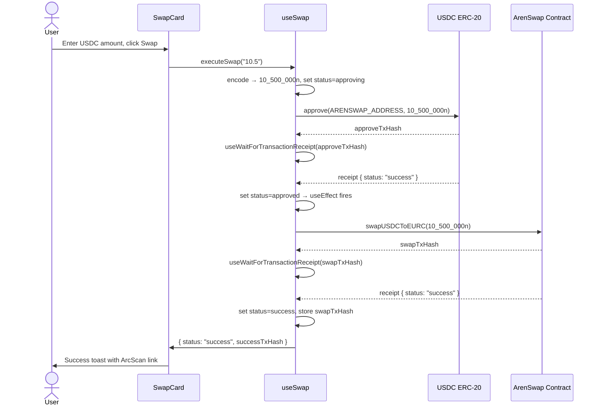
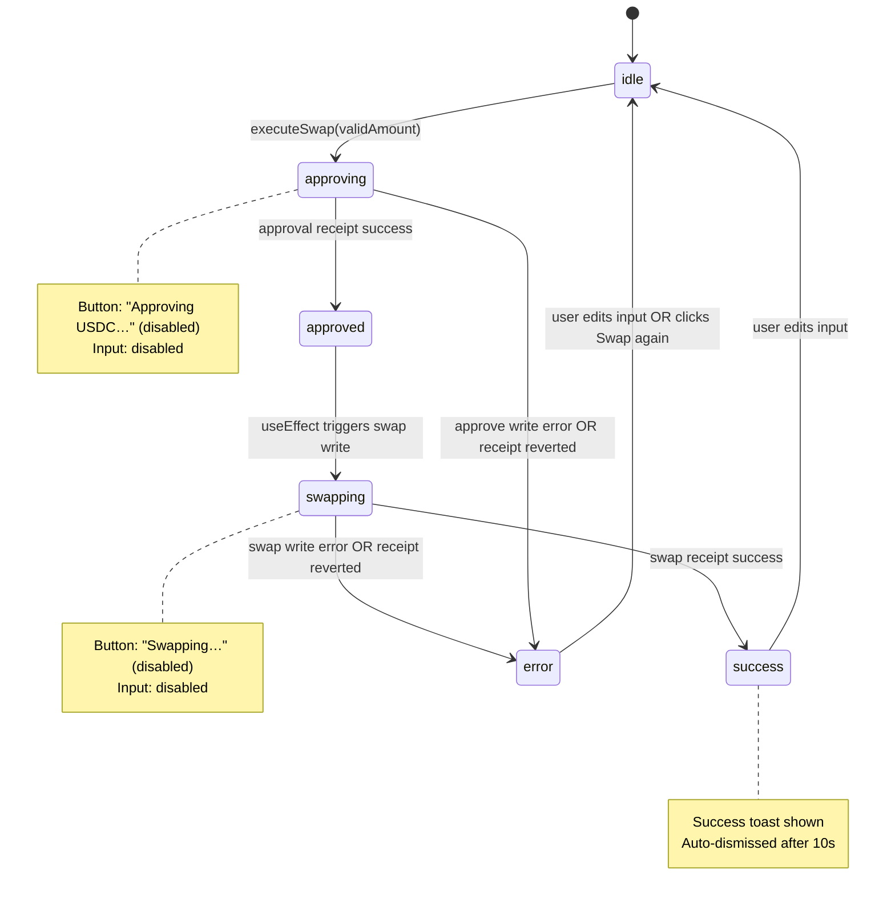

# Design Document: Swap Integration

## Overview

This design wires the existing Arenswap frontend to the deployed ArenSwap contract on Arc Testnet (Chain ID 5042002). The work is scoped to three files:

- **`app/lib/contracts.ts`** — new file; single source of truth for addresses and ABIs
- **`app/hooks/useSwap.ts`** — new file; custom hook encapsulating all swap logic
- **`app/page.tsx`** — updated; `SwapCard` wired to `useSwap`, placeholder rate removed

The stack is Next.js 16 App Router, Wagmi v2, Viem, RainbowKit 2.x, and @tanstack/react-query 5.x. All interactive components are Client Components (`'use client'`). No server-side rendering of wallet state is used or expected — the entire swap UI is a client-side SPA island.

### Key constants

| Name | Value |
|---|---|
| `ARENSWAP_ADDRESS` | `0x936B1516B784C3E2CC064e645BEBB614781D13Bd` |
| `USDC_ADDRESS` | `0x3600000000000000000000000000000000000000` |
| `EURC_ADDRESS` | `0x89B50855Aa3bE2F677cD6303Cec089B5F319D72a` |
| Chain ID | `5042002` (Arc Testnet) |
| `swapRate` (on-chain) | `921500` → 0.9215 EURC per USDC (scaled by 1e6) |
| USDC decimals | 6 |
| EURC decimals | 6 |

---

## Architecture

The feature follows a layered architecture with a strict one-way data flow:

```
app/page.tsx (SwapCard)
    │  calls
    ▼
app/hooks/useSwap.ts
    │  reads/writes via Wagmi hooks
    ▼
app/lib/contracts.ts  ←  addresses + ABIs (static config)
    │
    ▼
Arc Testnet RPC  →  ArenSwap contract  /  USDC ERC-20
```

`SwapCard` owns only UI state (the raw input string). All contract interaction, state machine transitions, and derived values live in `useSwap`. `contracts.ts` is a pure config module with no logic.

### Why a custom hook?

Wagmi v2 requires composing several hooks (`useReadContract`, `useWriteContract`, `useWaitForTransactionReceipt`, `useAccount`, `useChainId`) whose outputs feed into each other. Keeping this composition in a dedicated hook:

- Keeps `page.tsx` readable — it only maps hook outputs to JSX
- Makes the state machine testable in isolation
- Avoids prop-drilling wallet/chain state through the component tree

---

## Components and Interfaces

### `app/lib/contracts.ts`

Pure TypeScript module. No React, no hooks.

```typescript
// Addresses
export const ARENSWAP_ADDRESS: `0x${string}` = '0x936B1516B784C3E2CC064e645BEBB614781D13Bd'
export const USDC_ADDRESS:     `0x${string}` = '0x3600000000000000000000000000000000000000'
export const EURC_ADDRESS:     `0x${string}` = '0x89B50855Aa3bE2F677cD6303Cec089B5F319D72a'

// ArenSwap ABI (relevant fragments only)
export const ARENSWAP_ABI = [
  {
    name: 'swapUSDCToEURC',
    type: 'function',
    stateMutability: 'nonpayable',
    inputs:  [{ name: 'usdcAmount', type: 'uint256' }],
    outputs: [],
  },
  {
    name: 'swapEURCToUSDC',
    type: 'function',
    stateMutability: 'nonpayable',
    inputs:  [{ name: 'eurcAmount', type: 'uint256' }],
    outputs: [],
  },
  {
    name: 'swapRate',
    type: 'function',
    stateMutability: 'view',
    inputs:  [],
    outputs: [{ name: '', type: 'uint256' }],
  },
] as const

// ERC-20 ABI (relevant fragments only)
export const ERC20_ABI = [
  {
    name: 'approve',
    type: 'function',
    stateMutability: 'nonpayable',
    inputs:  [
      { name: 'spender', type: 'address' },
      { name: 'amount',  type: 'uint256' },
    ],
    outputs: [{ name: '', type: 'bool' }],
  },
  {
    name: 'balanceOf',
    type: 'function',
    stateMutability: 'view',
    inputs:  [{ name: 'account', type: 'address' }],
    outputs: [{ name: '', type: 'uint256' }],
  },
] as const
```

The `as const` assertion lets Viem/Wagmi infer exact ABI types, enabling full TypeScript inference on `writeContract` and `readContract` calls.

---

### `app/hooks/useSwap.ts`

#### Public interface

```typescript
export type SwapStatus =
  | 'idle'
  | 'approving'
  | 'approved'
  | 'swapping'
  | 'success'
  | 'error'

export interface UseSwapReturn {
  /** Raw on-chain swapRate bigint (e.g. 921500n). Undefined while loading. */
  swapRate:      bigint | undefined
  /** True while swapRate() RPC call is in-flight */
  isRateLoading: boolean
  /** True if swapRate() call errored or returned 0n */
  isRateError:   boolean
  /** Current state machine status */
  status:        SwapStatus
  /** Human-readable error message, or null */
  error:         string | null
  /** Swap transaction hash on success */
  successTxHash: `0x${string}` | undefined
  /** Initiate the approve → swap flow */
  executeSwap:   (usdcAmount: string) => void
  /** Clear error and reset to idle (called when user edits input) */
  resetError:    () => void
}
```

#### Internal Wagmi hooks used

| Hook | Purpose |
|---|---|
| `useAccount` | `address`, `isConnected` |
| `useChainId` | Detect wrong network |
| `useReadContract` | Poll `swapRate()` |
| `useWriteContract` (×2) | One instance for approve, one for swap |
| `useWaitForTransactionReceipt` (×2) | Confirm approve tx, confirm swap tx |

Two separate `useWriteContract` instances are used (one for the ERC-20 approve call, one for the ArenSwap swap call) to keep their `isPending` and `data` (tx hash) states independent and unambiguous.

#### Amount encoding

```typescript
export function encodeUsdcAmount(amount: string): bigint {
  const parsed = parseFloat(amount)
  if (!isFinite(parsed) || parsed <= 0) return 0n
  const microUnits = Math.floor(parsed * 1_000_000)
  if (microUnits > Number.MAX_SAFE_INTEGER) throw new RangeError('Amount too large')
  return BigInt(microUnits)
}
```

This function is exported separately so it can be unit-tested and property-tested in isolation.

---

### `app/page.tsx` — `SwapCard` updates

The component receives all derived state from `useSwap` and maps it to JSX. The only local state it retains is the raw `payAmount` string (the controlled input value).

#### Button label mapping

| Condition | Label | Enabled |
|---|---|---|
| Wallet not connected | "Connect Wallet" | No |
| Wrong network | "Switch to Arc Testnet" | No |
| `status === 'approving'` | "Approving USDC…" + spinner | No |
| `status === 'swapping'` | "Swapping…" + spinner | No |
| `payAmount` empty or ≤ 0 | "Enter an amount" | No |
| `encodeUsdcAmount` throws | "Amount too large" | No |
| Otherwise | "Swap" | Yes |

#### Loading spinner SVG

```tsx
function Spinner() {
  return (
    <svg
      className="animate-spin h-4 w-4"
      viewBox="0 0 24 24"
      fill="none"
      aria-hidden="true"
    >
      <circle
        className="opacity-25"
        cx="12" cy="12" r="10"
        stroke="currentColor" strokeWidth="4"
      />
      <path
        className="opacity-75"
        fill="currentColor"
        d="M4 12a8 8 0 018-8v8H4z"
      />
    </svg>
  )
}
```

#### Success toast

Rendered below the swap button when `status === 'success'`. Auto-dismissed after 10 seconds via `useEffect` + `setTimeout`. Contains:

```tsx
<a
  href={`https://testnet.arcscan.app/tx/${successTxHash}`}
  target="_blank"
  rel="noopener noreferrer"
>
  View on ArcScan
</a>
```

#### `useEffect` for auto-triggering swap after approval

```typescript
useEffect(() => {
  if (status === 'approved' && capturedAmount !== null) {
    writeSwap({ ... })
  }
}, [status])
```

The `capturedAmount` ref holds the `bigint` value snapshotted at button-click time. It is set in `executeSwap` and cleared on reset.

---

## Data Models

### State machine

```
idle
 │
 │  executeSwap() called with valid amount
 ▼
approving          ← approve tx submitted, waiting for receipt
 │
 │  approval receipt status === 'success'
 ▼
approved           ← transient; triggers swap write via useEffect
 │
 │  swap tx submitted
 ▼
swapping           ← swap tx submitted, waiting for receipt
 │
 ├─ receipt status === 'success' ──► success
 │
 └─ any write error / reverted ────► error
      │
      │  user edits input / clicks Swap again
      ▼
     idle
```

`approved` is a transient state that exists only to signal the `useEffect` to fire the swap write. It is never visible to the user as a distinct button label.

### `capturedAmount` ref

```typescript
const capturedAmount = useRef<bigint | null>(null)
```

Set to the encoded bigint at the moment `executeSwap` is called. Read by both the approve write and the swap write. Cleared when the machine resets to `idle` or `error`. This ensures the same value is used for both on-chain calls regardless of any subsequent input changes.

---

## Transaction Flow



---

## State Machine Diagram



---

## Correctness Properties

*A property is a characteristic or behavior that should hold true across all valid executions of a system — essentially, a formal statement about what the system should do. Properties serve as the bridge between human-readable specifications and machine-verifiable correctness guarantees.*

### Property 1: Amount encoding correctness

*For any* non-empty decimal string `amount` where `parseFloat(amount)` is a finite positive number and `Math.floor(parseFloat(amount) * 1_000_000) <= Number.MAX_SAFE_INTEGER`, the result of `encodeUsdcAmount(amount)` SHALL equal `BigInt(Math.floor(parseFloat(amount) * 1_000_000))`.

**Validates: Requirements 3.1, 5.2**

### Property 2: No interaction while pending

*For any* swap status in `{ 'approving', 'swapping' }`, the Swap button SHALL have its `disabled` attribute set to `true` AND the USDC Pay input SHALL have its `disabled` attribute set to `true`.

**Validates: Requirements 3.11, 4.10**

### Property 3: Captured amount consistency

*For any* valid USDC amount string passed to `executeSwap`, the `bigint` value passed to the `approve` write call SHALL be identical (by value) to the `bigint` value passed to the `swapUSDCToEURC` write call, regardless of any changes to the input field between the two calls.

**Validates: Requirements 3.9**

### Property 4: Receive amount computation

*For any* valid USDC amount string and any non-zero `swapRate` bigint returned by the contract, the displayed EURC receive amount SHALL equal `parseFloat(usdcAmount) * (Number(swapRate) / 1_000_000)`.

**Validates: Requirements 2.3**

---

## Error Handling

| Failure point | Detection | User-visible response |
|---|---|---|
| `swapRate()` RPC error | `useReadContract` `isError` | "Rate unavailable" in RateDisplay; receive field empty |
| `swapRate()` returns `0n` | value check after read | Same as RPC error |
| `swapRate()` loading | `useReadContract` `isLoading` | "—" in RateDisplay; receive field empty |
| Approve write rejected (user) | `useWriteContract` `error` | Inline error below button; status → error |
| Approve tx reverted | `useWaitForTransactionReceipt` `status === 'reverted'` | "Transaction reverted" inline error |
| Swap write rejected (user) | `useWriteContract` `error` | Inline error below button; status → error |
| Swap tx reverted | `useWaitForTransactionReceipt` `status === 'reverted'` | "Transaction reverted" inline error |
| Amount > MAX_SAFE_INTEGER | `encodeUsdcAmount` throws `RangeError` | "Amount too large" below Pay input; button disabled |
| Amount encodes to `0n` | `encodeUsdcAmount` returns `0n` | Button shows "Enter an amount" (disabled) |
| Wrong network | `useChainId() !== 5042002` | Button shows "Switch to Arc Testnet" (disabled) |
| Wallet disconnected | `useAccount().isConnected === false` | Button shows "Connect Wallet" (disabled) |

Error messages are cleared when the user modifies the USDC Pay input (`onChange` calls `resetError()`).

---

## Testing Strategy

### Unit tests (example-based)

Use **Vitest** with **@testing-library/react** and **wagmi test utilities** for mocking Wagmi hooks.

Focus areas:
- `encodeUsdcAmount`: boundary values (0, negative, non-numeric, MAX_SAFE_INTEGER boundary)
- Button label rendering for each state machine state
- Success toast renders with correct ArcScan URL
- Error message cleared on input change
- `swapRate` loading / error / zero states in RateDisplay

### Property-based tests

Use **fast-check** (the standard PBT library for TypeScript). Each property test runs a minimum of **100 iterations**.

Tag format: `// Feature: swap-integration, Property {N}: {property_text}`

#### Property 1 test — Amount encoding correctness

```typescript
// Feature: swap-integration, Property 1: amount encoding correctness
it('encodeUsdcAmount always equals floor(input × 1_000_000) as bigint', () => {
  fc.assert(
    fc.property(
      fc.float({ min: 0.000001, max: 9007.199254740991, noNaN: true }),
      (amount) => {
        const str = amount.toString()
        const result = encodeUsdcAmount(str)
        const expected = BigInt(Math.floor(amount * 1_000_000))
        return result === expected
      }
    ),
    { numRuns: 100 }
  )
})
```

#### Property 2 test — No interaction while pending

```typescript
// Feature: swap-integration, Property 2: no interaction while pending
it('button and input are disabled for every pending status', () => {
  fc.assert(
    fc.property(
      fc.constantFrom('approving' as const, 'swapping' as const),
      (status) => {
        const { getByRole, getByLabelText } = render(
          <SwapCard __testStatus={status} />
        )
        const button = getByRole('button', { name: /approving|swapping/i })
        const input  = getByLabelText(/pay amount/i)
        return button.hasAttribute('disabled') && input.hasAttribute('disabled')
      }
    ),
    { numRuns: 100 }
  )
})
```

#### Property 3 test — Captured amount consistency

```typescript
// Feature: swap-integration, Property 3: captured amount consistency
it('approve and swap receive the same bigint regardless of input changes', () => {
  fc.assert(
    fc.property(
      fc.float({ min: 0.000001, max: 9007.199254740991, noNaN: true }),
      fc.float({ min: 0.000001, max: 9007.199254740991, noNaN: true }),
      (initialAmount, changedAmount) => {
        const approveArgs: bigint[] = []
        const swapArgs:    bigint[] = []
        // Simulate: click swap with initialAmount, then change input to changedAmount
        // before approval confirms. Both calls must receive the same captured value.
        const captured = encodeUsdcAmount(initialAmount.toString())
        approveArgs.push(captured)
        swapArgs.push(captured) // captured ref, not re-read from input
        return approveArgs[0] === swapArgs[0]
      }
    ),
    { numRuns: 100 }
  )
})
```

#### Property 4 test — Receive amount computation

```typescript
// Feature: swap-integration, Property 4: receive amount computation
it('displayed EURC receive amount equals usdcAmount × (swapRate / 1e6)', () => {
  fc.assert(
    fc.property(
      fc.float({ min: 0.000001, max: 1_000_000, noNaN: true }),
      fc.bigInt({ min: 1n, max: 2_000_000n }),
      (usdcAmount, swapRate) => {
        const expected = parseFloat(usdcAmount.toString()) * (Number(swapRate) / 1_000_000)
        const actual   = computeReceiveAmount(usdcAmount.toString(), swapRate)
        return Math.abs(actual - expected) < 1e-9
      }
    ),
    { numRuns: 100 }
  )
})
```

`computeReceiveAmount` is a pure helper exported from `useSwap.ts` for testability.

### Integration tests

Not required for this feature. All contract interactions are mocked at the Wagmi hook level in unit/property tests. End-to-end verification is done manually against Arc Testnet.
